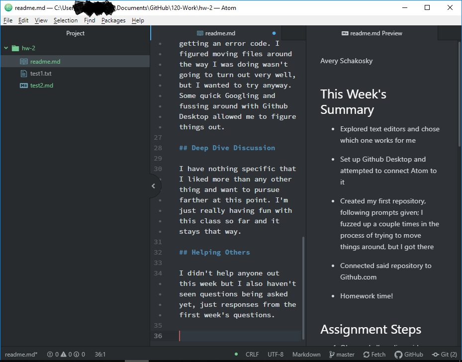

Avery Schakosky

## This Week's Summary

* Explored text editors and chose which one works for me

* Set up Github Desktop and attempted to connect Atom to it

* Created my first repository, following prompts given; I fuzzed up a couple times in the process of trying to move things around, but I got there

* Connected said repository to Github.com

* Homework time!

## Assignment Steps

1. Observed all reading, videos, etc.
2. Followed exercises and prompts provided during the lesson
3. Added new readme file to homework folder via Atom
4. Used Markdown Cheat Sheet to work on this assigment

## Problems and Issues

I struggled only a couple times but everything worked out in the end, for the most part. I tried to connect Atom to Github Desktop but Github Desktop kept saying I had to install Atom, despite having it installed; still haven't figured out what's going on but the drag-and-drop method works for me just fine.

The other issue I had was was just me screwing around with the repository and getting an error code. I figured moving files around the way I was doing wasn't going to turn out very well, but I wanted to try anyway. Some quick Googling and fussing around with Github Desktop allowed me to figure things out.

## Deep Dive Discussion

I have nothing specific that I liked more than any other thing and want to pursue farther at this point. I'm just really having fun with this class so far and it stays that way.

## Helping Others

I didn't help anyone out this week but I also haven't seen questions being asked yet, just responses from the first week's questions.

## Screenshot

